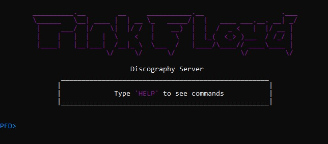
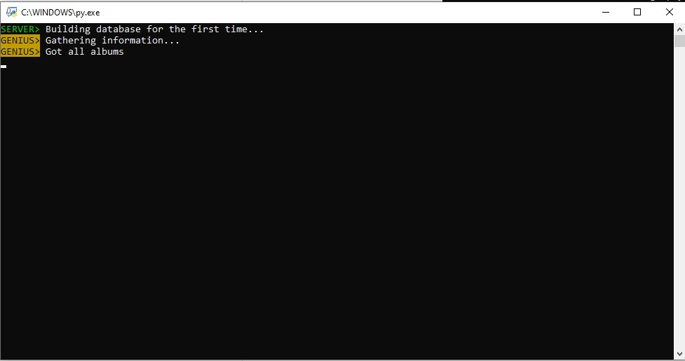
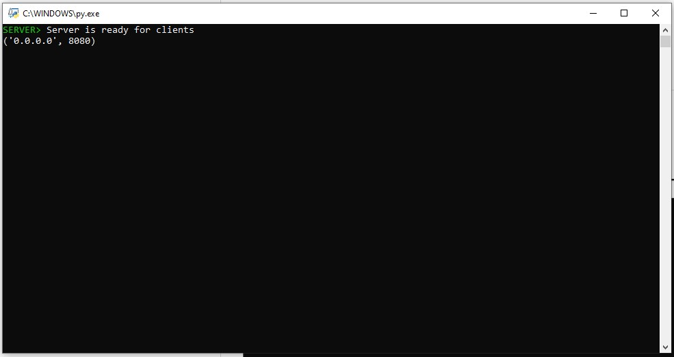
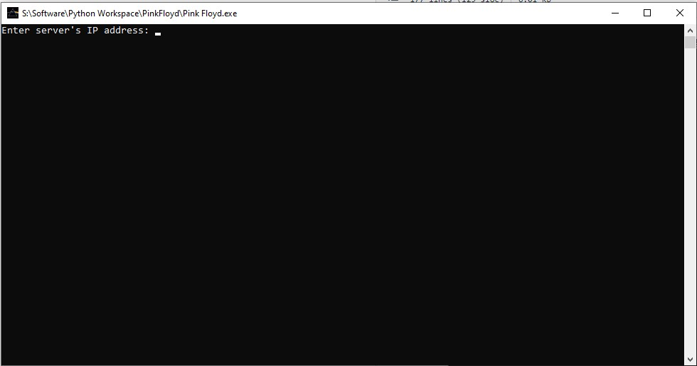
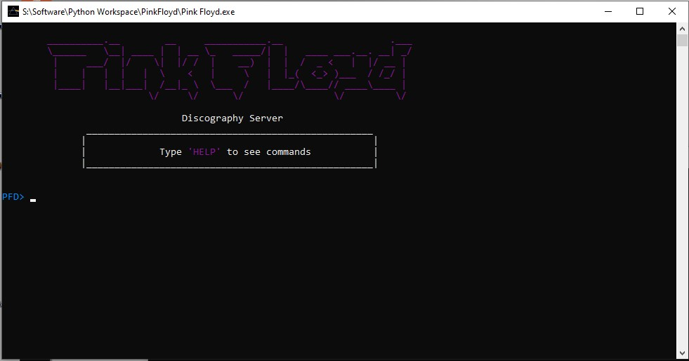

<!-- PROJECT SHIELDS -->
<!--
*** I'm using markdown "reference style" links for readability.
*** Reference links are enclosed in brackets [ ] instead of parentheses ( ).
*** See the bottom of this document for the declaration of the reference variables
*** for contributors-url, forks-url, etc. This is an optional, concise syntax you may use.
*** https://www.markdownguide.org/basic-syntax/#reference-style-links
-->
[![LinkedIn][linkedin-shield]][linkedin-url]


<!-- PROJECT LOGO -->
<br />
<div align="center">
  <a href="https://github.com/Bo0gieMan-VP/PFD">
    
  </a>

<h3 align="center">Pink Floyd Discography Server</h3>

  <p align="center">
    Studential Project of Pink Floyd's Discography
    <br />
    <br />
    <a href="https://github.com/Bo0gieMan-VP/PFD">View Demo</a>
    ·
    <a href="https://github.com/Bo0gieMan-VP/PFD/issues">Report Bug</a>
    ·
    <a href="https://github.com/Bo0gieMan-VP/PFD/issues">Request Feature</a>
  </p>
</div>


<!-- TABLE OF CONTENTS -->
<details>
  <summary>Table of Contents</summary>
  <ol>
    <li>
      <a href="#about-the-project">About The Project</a>
      <ul>
        <li><a href="#built-with">Built With</a></li>
      </ul>
    </li>
    <li><a href="#usage">Usage</a></li>
    <li><a href="#commands">Commands</a></li>
    <li><a href="#license">License</a></li>
    <li><a href="#contact">Contact</a></li>
  </ol>
</details>


<!-- ABOUT THE PROJECT -->
## About The Project
<div align="center">
  

Socket based project, Server-side that can give information about Pink Floyd <br />
On the Client-side the client can use commands to get the information from the server<br />
</div>

<p align="right">(<a href="#top">back to top</a>)</p>


### Built With

[Python](https://www.python.org/)
<details>
  <summary>Used Modules</summary>
  <ol>
    <li><a href="https://docs.python-requests.org/en/latest/">Requests</a></li>
    <li><a href="https://spotipy.readthedocs.io/en/2.19.0/">Spotipy</a></li>
    <li><a href="https://pypi.org/project/lyricsgenius/">LyricsGenius</a></li>
  </ol>
</details>
<details>
  <summary>Used APIs</summary>
  <ol>
    <li>Spotify</li>
    <li>Genius</li>
    <li>YouTube Data</li>
  </ol>
</details>


<p align="right">(<a href="#top">back to top</a>)</p>


<!-- USAGE EXAMPLES -->
## Usage

**Default Administrator password is** ```admin```

### STEP 1
When running the server for the first time the server will start building it's database<br />
This will take some time



### STEP 2
When the server is done building it's database it will notify



### STEP 3
Start the client's window and insert the server's IP address.<br />
_if the server running on the same PC you can use `my_ip`_



### STEP 4
Now that you can see the welcome screen you're good to go!<br />
_remember, if you don't know what you do you can always type `HELP`_



<p align="right">(<a href="#top">back to top</a>)</p>

<!-- COMMANDS -->
## Commands

### User Commands
| Command   |   Argument   |   Description   |
|:----------|:------------:|:----------------|
| **GETALBUMS** |  None| Get a list of Pink Floyd's albums|
| **FINDALBUM** | Name of Album | Find whether an album is Pink Floyd's |
| **ALBUMDUR** | Name of Album | Get the total length of an album |
| **LISTSONGS** | Name of Album | Get a list of all the songs in the album |
| **FINDSONG** | Name of Song | Find whether a song is Pink Floyd's, if yes, you'll see it's album |
| **HOWLONG** | Name of Song | Get the song's length |
| **GETLYRICS** | Name of Song | Get the song's lyrics |
| **PLAY** | Name of Song | Play the selected song |
| **FINDLYRICS** | Lyrics | Find songs containing the specified lyrics (can be more than one word) |
| **GOADMIN** | Password | Get Administrator Privileges |


### Admin Commands
| Command   |   Description   |
|:----------|:----------------|
| **UPDATE** | Update the server's database |
| **SHUTDOWN** | Shut the server down |
| **SCLEAR** | Clear the server's window |
| **GOUSER** | Get User Privileges |
| **SET** | Change the server config |

### SET Commands
| Command   |   Description   |
|:----------|:----------------|
| **METHOD** | Change the database updating method<br>(G = Genius / S = Spotify) |
| **PASS** | Change administator password |
| **HELP** | See available SET commands |


### Utility Commands
| Command   |   Description   |
|:----------|:----------------|
| **HELP** | See available commands |
| **CLEAR** | Clear the client's window |
| **QUIT** | Kill the connection and exit the program |

<p align="right">(<a href="#top">back to top</a>)</p>

<!-- LICENSE -->
## License

See `LICENSE.txt` for more information.

<p align="right">(<a href="#top">back to top</a>)</p>


<!-- CONTACT -->
## Contact

Benny Kerido - kerido112@gmail.com

Project Link: [https://github.com/Bo0gieMan-VP/PFD](https://github.com/Bo0gieMan-VP/PFD)

<p align="right">(<a href="#top">back to top</a>)</p>


<!-- MARKDOWN LINKS & IMAGES -->
<!-- https://www.markdownguide.org/basic-syntax/#reference-style-links -->
[contributors-shield]: https://img.shields.io/github/contributors/Bo0gieMan-VP/PFD.svg?style=for-the-badge
[contributors-url]: https://github.com/Bo0gieMan-VP/PFD/graphs/contributors
[forks-shield]: https://img.shields.io/github/forks/Bo0gieMan-VP/PFD.svg?style=for-the-badge
[forks-url]: https://github.com/Bo0gieMan-VP/PFD/network/members
[stars-shield]: https://img.shields.io/github/stars/Bo0gieMan-VP/PFD.svg?style=for-the-badge
[stars-url]: https://github.com/Bo0gieMan-VP/PFD/stargazers
[issues-shield]: https://img.shields.io/github/issues/Bo0gieMan-VP/PFD.svg?style=for-the-badge
[issues-url]: https://github.com/Bo0gieMan-VP/PFD/issues
[license-shield]: https://img.shields.io/github/license/Bo0gieMan-VP/PFD.svg?style=for-the-badge
[license-url]: https://github.com/Bo0gieMan-VP/PFD/blob/master/LICENSE.txt
[linkedin-shield]: https://img.shields.io/badge/-LinkedIn-black.svg?style=for-the-badge&logo=linkedin&colorB=555
[linkedin-url]: https://www.linkedin.com/in/bennykerido/
[product-screenshot]: images/client-screen.jpg
